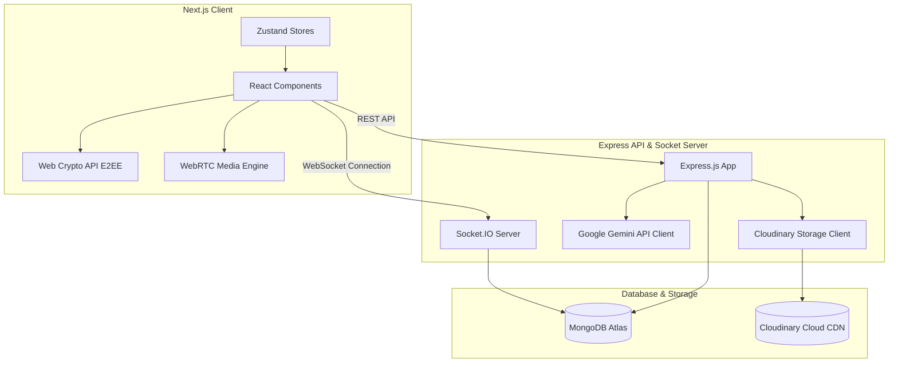
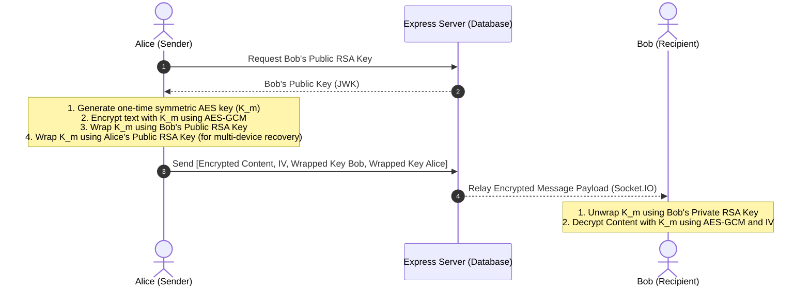

# ForeverUs - AI-Powered Couple Sanctuary

ForeverUs is an enterprise-grade, production-ready SaaS couple platform built with **Next.js 15 (React 19)** and **Node.js Express + Socket.IO**. It features secure **End-to-End Encrypted (E2EE) Chat**, browser-native **WebRTC calling**, album-tagged **Memory Vaults**, interactive **Couple Games**, and a weekly **AI Relationship Advisor** powered by Google Gemini.

---

## 🏗️ System Architecture



---

## 📂 Project Structure

```
ForeverUs/
├── backend/
│   ├── src/
│   │   ├── config/              # Core Service Configs
│   │   ├── controllers/         # REST API Route Handlers
│   │   ├── middleware/          # JWT Auth, Security & Rate limit
│   │   ├── models/              # Mongoose DB Schemas
│   │   ├── routes/              # Express master router endpoints
│   │   ├── services/            # Socket.IO, WebRTC Signal, Gemini AI, Cloudinary
│   │   └── app.ts               # Express boot entry point
│   ├── package.json
│   ├── tsconfig.json
│   └── .env
└── frontend/
    ├── src/
    │   ├── app/                 # Next.js 15 App Router
    │   ├── components/          # Shared Navbars & Client Shell Wrapper
    │   ├── hooks/               # Custom hooks
    │   ├── lib/                 # Fetch API wrapper & Web Crypto E2EE
    │   ├── store/               # Zustand state machines
    │   └── types/               # TypeScript Definitions
    ├── package.json
    ├── tailwind.config.ts
    └── postcss.config.mjs
```

---

## 🔒 End-to-End Encryption (E2EE) Protocol

The messaging features use a hybrid cryptosystem combining symmetric encryption for payloads and asymmetric encryption for key exchange, running inside the browser's sandbox using the **Web Crypto API**:



*Note: Private keys are encrypted using a PBKDF2 key derived from the user's password and a random salt before being backed up to the server. Decryption occurs strictly in-memory during session unlocking.*

---

## 🚀 Getting Started

### 1. Requirements
- Node.js (v18 or higher)
- Local MongoDB or MongoDB Atlas instance
- Google Gemini API Key
- Cloudinary Storage credentials (optional; defaults to local disk uploads fallback)

### 2. Backend Setup
1. Open a terminal in `/backend` folder:
   ```bash
   cd backend
   npm install
   ```
2. Create your `.env` file from the example:
   ```bash
   cp .env.example .env
   ```
3. Boot the Express API and Socket.IO server:
   ```bash
   npm run dev
   ```
   *The backend will boot up on `http://localhost:5000`.*

### 3. Frontend Setup
1. Open a second terminal in `/frontend` folder:
   ```bash
   cd frontend
   npm install
   ```
2. Boot the Next.js development server:
   ```bash
   npm run dev
   ```
   *The client will start on `http://localhost:3000`.*

---

## 🔗 API Documentation

### Authentication (`/api/auth`)
- `POST /register`: Registers user credentials, logs test verification OTP code.
- `POST /verify-otp`: Confirms OTP code and issues JWT authentication token.
- `POST /login`: Validates password and grants JWT session token.
- `PUT /profile`: Updates bio details, profile picture URL, and name.
- `POST /keys`: Backs up client-side public RSA keys and encrypted private keys.
- `GET /me`: Fetches current user profile and paired partner's details.

### Couples Pairing (`/api/couple`)
- `POST /generate-code`: Creates a random 6-character connect code active for 24 hours.
- `POST /pair`: Inputs a partner's code to establish a link.
- `POST /unpair`: Removes pairing links.

### Secure Messaging (`/api/chat`)
- `GET /chat/messages`: Retrieves paginated couple message records.
- `POST /chat/upload`: Handles image/video/voice note attachment uploads.
- `PUT /chat/messages/:id/edit`: Edits secure ciphertext.
- `DELETE /chat/messages/:id/everyone`: Flags message as deleted.
- `PUT /chat/messages/:id/pin`: Toggles pinning state.

---

## 🚢 Deployment Guide

### Database (MongoDB Atlas)
1. Register on MongoDB Atlas, create a free-tier shared M0 cluster.
2. Under Network Access, allow IPs (`0.0.0.0/30` for Vercel/Render).
3. Copy the Connection URI and add it to `MONGODB_URI` environment variable.

### Backend (Render or Railway)
1. Push the `/backend` codebase to a GitHub repository.
2. In Render, select **New Web Service**, connect the repo, and set the root directory to `backend`.
3. Build Command: `npm install && npm run build`
4. Start Command: `npm run start`
5. Configure Environment Variables (`PORT`, `MONGODB_URI`, `JWT_SECRET`, `GEMINI_API_KEY`).

### Frontend (Vercel)
1. Create a project in Vercel, connect the repository, and set the root directory to `frontend`.
2. Vercel automatically detects Next.js configurations.
3. Deploy!
